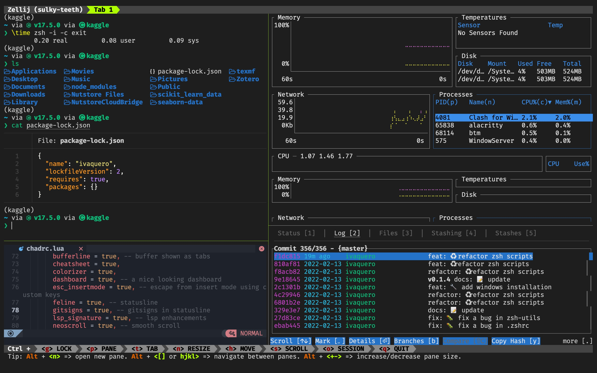

# Oxidizer.sh

针对 Rust Toolchains 的简约和可扩展的 Dotfile 解决方案

让我们来催化您的开发环境。

> Oxidizer 目前认为开发阶段，使用时风险自负，但是我们会尽可能地提供更多的功能。



## 从这里开始

针对 macOS / Linux 操作系统

> 目前已经基本稳定，请放心使用

```bash
# define the Oxidizer home
export OXIDIZER=$HOME/oxidizer

git clone --depth=1 https://github.com/ivaquero/oxidizer.sh.git $OXIDIZER
sh $Oxidizer/oxidizer.sh
```

针对 Windows 操作系统

> [❗WIP❗] 目前未经过我们测试，请谨慎使用，将来会通知测试结果。

```powershell
# define the Oxidizer home
$env:oxidizer = '%USERPROFILE%/oxidizer'
[Environment]::SetEnvironmentVariable('Oxidizer', $env:oxidizer, 'User')

git clone --depth=1 https://github.com/ivaquero/oxidizer.sh.git $env:oxidizer
powershell $env:oxidizer/oxidizer.ps1
```

- 针对中国大陆用户，您可以用下面的方法设置设置 `BREW_CN` 变量：

```bash
export $BREW_CN=1
```

安装之后，您可以使用以下命令来查看个性化您的系统环境 `custom.sh` (请查阅 `demo-custom.sh`).

为了保持系统更新，请输入 oxidizer rootpath 并使用 `oxup` 命令来更新系统：

```bash
cd oxidizer && oxup
```

<p>
<a href="user-guide-CN.md">使用指南</a>
</p>

## Oxidizer 的主要目标

- 跨平台使用 (Mainly Rust Toolchains)
- 最小化依赖
- 可扩展架构
- 真 TM 快！ (当前读取时间可达 0.20 秒)

## 配置文件

- Shells
  - Zsh
  - Powershell
  - Nushell
- Terminals
  - Alacritty
  - Zellij
- Packge Managers
  - Conda
  - WinGet
- Editors
  - VSCode:
    - settings
    - keybindings
    - snippets
  - NeoVim (Lua Style, based on NvChad)
    - init
    - chadrc
    - plugins
- Other Softwares
  - Aria2
  - Julia
  - Rectangle (macOS)
- Classic Tools (works well but stop being maintained)
  - TMux
  - NeoVim (Vim Style)

> 此存储库包括日常使用的杂项文件.

## Oxidizing 指令

### 命令行替换

- [x] 使用 `bat` 替换 `cat`
- [x] 使用 `bottom` 替换 `top` 和 `htop`
- [x] 使用 `du` 替换 `dust`
- [x] 使用 `fd` 替换 `find`
- [x] 使用 `gitui` 替换 `lazygit`
- [x] 使用 `ls --tree` 替换 `tree`
- [x] 使用 `lsd` 替换 `ls`
- [x] 使用 `ripgrep` 替换 `grep`
- [x] 使用 `sd` 替换 `sed`
- [x] 使用 `tealdeer` 替换 `tldr` 和 `man`
- [x] 使用 `zoxide` 替换 `cd` 和 `z.lua`
- [x] 使用 `zellij` 替换 `tmux`
- [x] 使用 `texlab` 替换 `latexindent`

### 终端软件替换

- [x] 使用 `Alacritty` 替换 `iTerm2` 和 `Windows Terminal`

### 工具箱

- [x] delta
- [x] hyperfine
- [x] kondo

## Shell

### Zsh

- [x] 基于智能判断 Arm64 或 Intel 平台的 conda 环境管理系统
- [x] 抑制 Arm64 引发的 Homebrew 错误消息
- [x] 集成 Aria2 下载 Homebrew Casks
- [x] 集成使用预下载功能的 Homebrew 安装器

### PowerShell

- [x] 集成 Scoop
- [ ] 重新植入 Zsh 功能
- [ ] 集成到了 Alacritty 内

### NuShell

- [ ] 重新植入 Zsh 功能
  - [x] zsh-cpp
  - [ ] zsh-julia
  - [x] zsh-nodejs
  - [ ] zsh-python
  - [ ] zsh-rust
  - [x] zsh-texlive
- [ ] 集成 Conda
- [ ] 集成进了 Alacritty

## Multiplexer

### Zellij

- [x] 重新定义的界面
- [x] 集成进了 Alacritty
  - [x] 光标快捷指令
  - [x] 窗口快捷指令
  - [x] 分屏快捷指令

### TMux

- [x] 关连剪贴板
- [x] 自动回复上次内容
- [x] 集成进了 Alacritty
  - [x] 光标快捷指令
  - [x] 窗口快捷指令
  - [x] 分屏快捷指令

## Editor

### NeoVim

对于 NeoVim, 我推荐使用 NvChad 用来搭建一个纯净的 Lua 设置.

### Helix

- [ ] 取代 NeoVim
- [ ] 集成进 Alacritty

## System

### macOS

- [x] 更新系统
- [x] 清除缓存垃圾
- [x] 文件签名

## Tools

### Git

- [x] 查找 git 自动产生的打包文件

- [ ] 集成 `git filter-repo` 命令

### Pandoc

- [x] 转换 markdown 到 pdf (使用 cjk unicode)

## Widgets

- [x]天气插件 (使用 wttr/in)

## 插件总结

<table border="1">
  <thead>
    <tr>
      <td></td>
      <td>Linux</td>
      <td>macOS</td>
      <td>Windows</td>
    </tr>
  </thead>
  <tbody>
    <tr>
      <td>Brew</td>
      <td>✓</td>
      <td>✓</td>
      <td></td>
    </tr>
    <tr>
      <td>Scoop</td>
      <td></td>
      <td></td>
      <td>✓</td>
    </tr>
    <tr>
      <td>Zsh</td>
      <td>✓</td>
      <td>✓</td>
      <td></td>
    </tr>
    <tr>
      <td>Powershell</td>
      <td></td>
      <td></td>
      <td>✓</td>
    </tr>
    <tr>
      <td>NuShell</td>
      <td></td>
      <td></td>
      <td></td>
    </tr>
    <tr>
      <td>Conda</td>
      <td>✓</td>
      <td>✓</td>
      <td>✓</td>
    </tr>
    <tr>
      <td>VSCode <br />Extensions</td>
      <td>✓</td>
      <td>✓</td>
      <td>✓</td>
    </tr>
    <tr>
      <td>Node</td>
      <td>✓</td>
      <td>✓</td>
      <td>✓</td>
    </tr>
    <tr>
      <td>Rust</td>
      <td></td>
      <td></td>
      <td></td>
    </tr>
    <tr>
      <td>Julia</td>
      <td>✓</td>
      <td>✓</td>
      <td>✓</td>
    </tr>
    <tr>
      <td>TeXlive</td>
      <td>✓</td>
      <td>✓</td>
      <td></td>
    </tr>
  </tbody>
</table>

<details>
  <summary>style</summary>
  <style>
    table {
      border-collapse: collapse;
      text-align: center;
    }
  </style>
</details>

## 发布许可

这个项目是在 MIT 许可下发布.

## 致谢

- [Mario Catuogno's Clean-macOS](https://github.com/MarioCatuogno/Clean-macOS)
- [Mike McQuaid's dotfiles](https://github.com/MikeMcQuaid/dotfiles)
